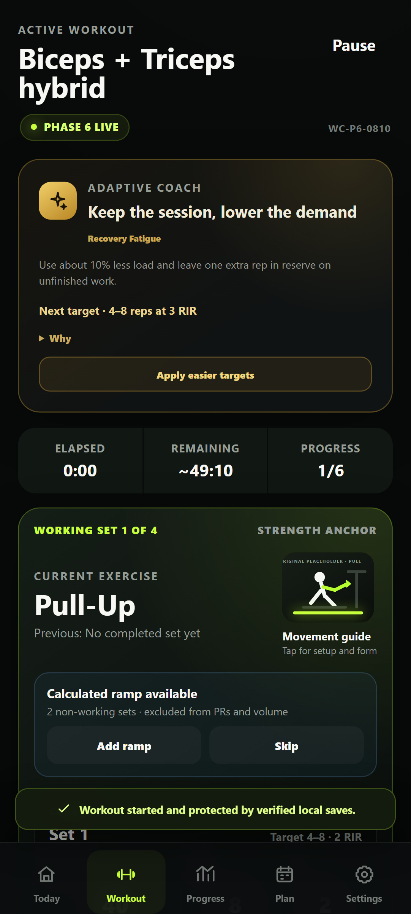

# Workout Conductor — Project Status

| Field                  | Status                                                                                                                                                                                                                                                                                                                                                                                                                                                                                                                                           |
| ---------------------- | ------------------------------------------------------------------------------------------------------------------------------------------------------------------------------------------------------------------------------------------------------------------------------------------------------------------------------------------------------------------------------------------------------------------------------------------------------------------------------------------------------------------------------------------------ |
| Repository             | https://github.com/Bill6006/Workout-Conductor-Rebuild                                                                                                                                                                                                                                                                                                                                                                                                                                                                                            |
| Permanent live app     | https://bill6006.github.io/Workout-Conductor-Rebuild/                                                                                                                                                                                                                                                                                                                                                                                                                                                                                            |
| Current phase          | Phase 6 — Adaptive Coaching and Progression                                                                                                                                                                                                                                                                                                                                                                                                                                                                                                      |
| Current branch         | `main`                                                                                                                                                                                                                                                                                                                                                                                                                                                                                                                                           |
| Latest completed phase | Phase 5 — approved GREEN by user                                                                                                                                                                                                                                                                                                                                                                                                                                                                                                                 |
| Work in progress       | Phase 6 complete and YELLOW pending Android review                                                                                                                                                                                                                                                                                                                                                                                                                                                                                               |
| Latest commit          | [Current `main` commit](https://github.com/Bill6006/Workout-Conductor-Rebuild/commits/main/)                                                                                                                                                                                                                                                                                                                                                                                                                                                     |
| Latest deployment      | [GitHub Pages workflow](https://github.com/Bill6006/Workout-Conductor-Rebuild/actions/workflows/deploy-pages.yml)                                                                                                                                                                                                                                                                                                                                                                                                                                |
| Tests                  | 97 unit/integration + 6 Android browser tests passed; lint, privacy, formatting, build, PWA, persistence, progression, readiness, confirmation, responsive, superset, and visual checks passed                                                                                                                                                                                                                                                                                                                                                   |
| Known limitations      | History/PR analytics and the deeper Session Summary remain gated to Phase 7; final production media coverage and custom-media backup/restore remain gated to Phase 8                                                                                                                                                                                                                                                                                                                                                                             |
| Phase 6 screenshots    | [Readiness](docs/screenshots/phase-6/readiness-coach-412x915.png), [Active](docs/screenshots/phase-6/active-workout-412x915.png), [Confirmation](docs/screenshots/phase-6/coach-confirmation-412x915.png), [360 px Logger](docs/screenshots/phase-6/set-logging-360x800.png), [Alternatives](docs/screenshots/phase-6/alternatives-412x915.png), [Superset](docs/screenshots/phase-6/superset-412x915.png), [Pause](docs/screenshots/phase-6/paused-resume-412x915.png), [Desktop](docs/screenshots/phase-6/active-workout-desktop-1280x900.png) |
| Next concrete action   | Wait for `GREEN - NEXT PHASE`, `YELLOW - FIX: <issue>`, or `RED - STOP`                                                                                                                                                                                                                                                                                                                                                                                                                                                                          |
| Last updated           | 2026-08-10 22:45 EDT                                                                                                                                                                                                                                                                                                                                                                                                                                                                                                                             |

## Phase 6 acceptance

- [x] Progression engine with double, load, rep, set, hold, and repeated-failure regression paths
- [x] Readiness, fatigue, recovery, performance recalibration, pain handling, and session feedback
- [x] Actual completed records and manual corrections remain the source of truth
- [x] One gold Adaptive Coach, exact priority arbitration, one main action maximum, and concise Why
- [x] Two-move superset evidence with incomplete next-round exclusion
- [x] Recent qualifying session analysis without persisted large snapshots
- [x] Load, rep, fatigue, recovery, exercise-fit, and weekly-coverage diagnosis
- [x] Intelligent rest and safe optional drop-set recommendations
- [x] All structural actions require confirmation and preserve completed work
- [x] 360 / 375 / 412 / 430 px and 150% zoom behavior tested without horizontal overflow
- [x] Phase marked YELLOW for user review; Phase 7 not started

## Evidence

The coaching contract is in [docs/adaptive-coach.md](docs/adaptive-coach.md), with full phase evidence in [docs/phase-reports/PHASE_6.md](docs/phase-reports/PHASE_6.md).

## Data-safety status

The repository contains application code, blank defaults, synthetic test fixtures, and synthetic presentation copy only. Real profile, workout records, and cue memory remain browser-local and are not committed.
