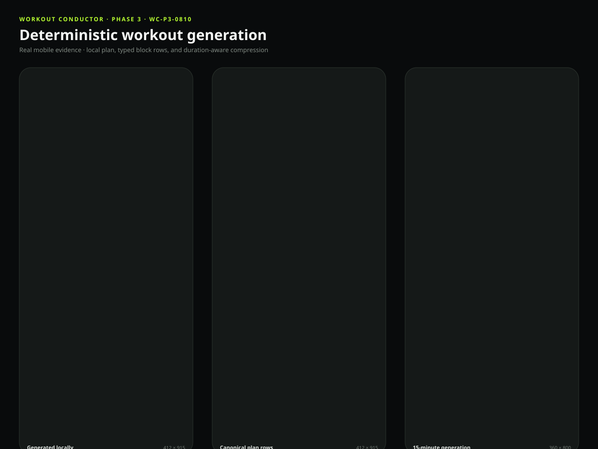
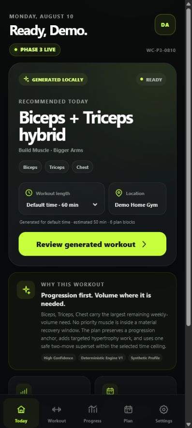
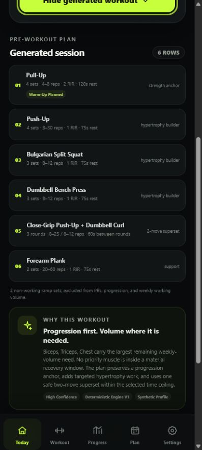
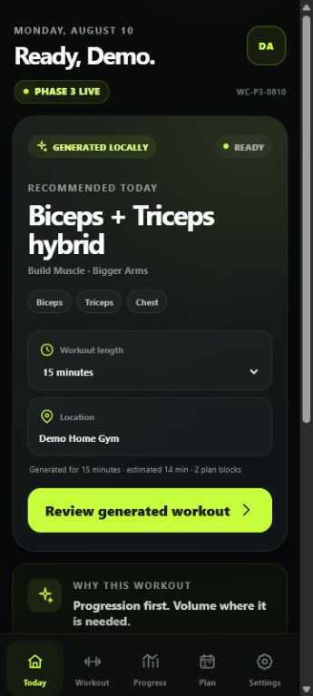

# Workout Conductor — Project Status

| Field                  | Status                                                                                                                                                                                                                                                                                                                               |
| ---------------------- | ------------------------------------------------------------------------------------------------------------------------------------------------------------------------------------------------------------------------------------------------------------------------------------------------------------------------------------ |
| Repository             | https://github.com/Bill6006/Workout-Conductor-Rebuild                                                                                                                                                                                                                                                                                |
| Permanent live app     | https://bill6006.github.io/Workout-Conductor-Rebuild/                                                                                                                                                                                                                                                                                |
| Current phase          | Phase 3 — Workout Generation and Duration Intelligence                                                                                                                                                                                                                                                                               |
| Current branch         | `main`                                                                                                                                                                                                                                                                                                                               |
| Latest completed phase | Phase 3 — YELLOW pending user Android review; Phase 2 approved GREEN                                                                                                                                                                                                                                                                 |
| Work in progress       | Stopped at the Phase 3 review gate                                                                                                                                                                                                                                                                                                   |
| Latest commit          | [Current `main` commit](https://github.com/Bill6006/Workout-Conductor-Rebuild/commits/main/)                                                                                                                                                                                                                                         |
| Latest deployment      | [GitHub Pages workflow](https://github.com/Bill6006/Workout-Conductor-Rebuild/actions/workflows/deploy-pages.yml) — successful                                                                                                                                                                                                       |
| Tests                  | 49 unit/storage/engine + 4 Android browser tests passed; lint, privacy, build verification, formatting, and PWA build passed                                                                                                                                                                                                         |
| Known limitations      | Generation is pre-workout only; central recalibration, active logging/replacement, and production demonstration media remain gated                                                                                                                                                                                                   |
| Mobile screenshots     | [Combined](docs/screenshots/phase-3/combined-preview.svg), [Generator](docs/screenshots/phase-3/generator-412x915.png), [Expanded plan](docs/screenshots/phase-3/generated-plan-412x915.png), [15-minute plan](docs/screenshots/phase-3/duration-15-360x800.png), [Desktop](docs/screenshots/phase-3/generator-desktop-1280x900.png) |
| Next concrete action   | Wait for `GREEN - NEXT PHASE`, `YELLOW - FIX: <issue>`, or `RED - STOP`                                                                                                                                                                                                                                                              |
| Last updated           | 2026-08-10 16:30 EDT                                                                                                                                                                                                                                                                                                                 |

## Phase 3 acceptance

- [x] Deterministic browser-local generation from profile, goals, location, equipment, guardrails, time, and preferences
- [x] Hybrid strength and hypertrophy structure with explicit progression roles
- [x] Weekly-volume deficits and recent-exposure recovery logic
- [x] One duration dropdown with 15, 30, 45, and profile-default generation
- [x] Preparation, ramp, setup, transition, working-time, and rest estimation
- [x] Warm-up records excluded from progression, PRs, and weekly working volume
- [x] Smart two-move supersets stored as two durable prescriptions and one canonical list row
- [x] Optional safe final drop sets and goal-compatible short-session circuits
- [x] Workout explanation, confidence, compromises, and future recalibration metadata
- [x] Supported 360 / 375 / 412 / 430 px widths tested without horizontal overflow
- [x] Phase marked YELLOW for user review

## Mobile screenshot

## Data-safety status

The repository contains application code, blank defaults, and synthetic presentation copy only. It contains no workout history, personal notes, backups, contact information, or other private user data.
