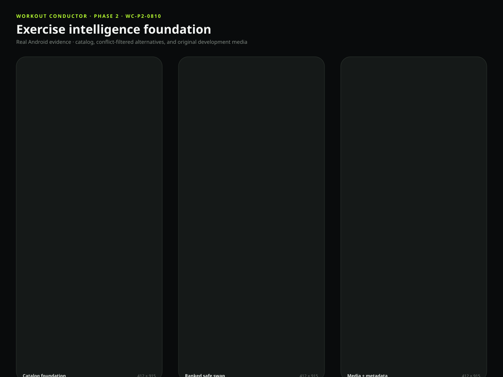
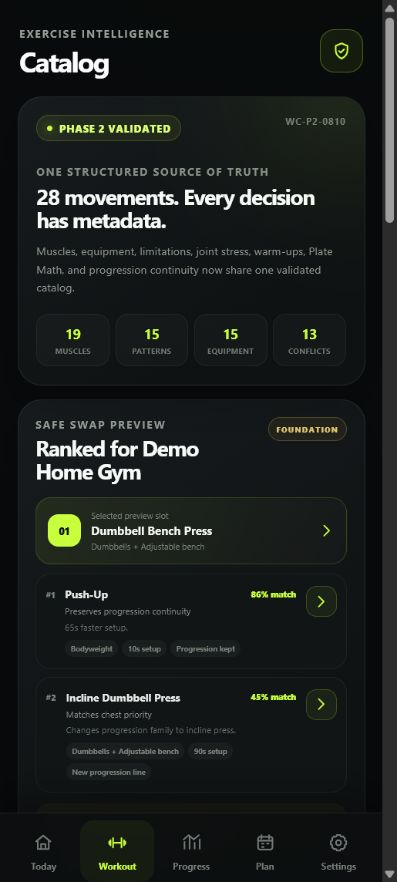
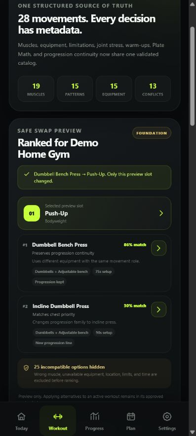
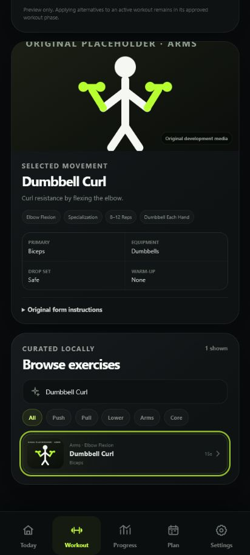

# Workout Conductor — Project Status

| Field                  | Status                                                                                                                                                                                                                                                                                                                  |
| ---------------------- | ----------------------------------------------------------------------------------------------------------------------------------------------------------------------------------------------------------------------------------------------------------------------------------------------------------------------- |
| Repository             | https://github.com/Bill6006/Workout-Conductor-Rebuild                                                                                                                                                                                                                                                                   |
| Permanent live app     | https://bill6006.github.io/Workout-Conductor-Rebuild/                                                                                                                                                                                                                                                                   |
| Current phase          | Phase 2 — Exercise Catalog, Media, and Conflict Engine                                                                                                                                                                                                                                                                  |
| Current branch         | `main`                                                                                                                                                                                                                                                                                                                  |
| Latest completed phase | Phase 2 — YELLOW pending user Android review                                                                                                                                                                                                                                                                            |
| Work in progress       | Stopped at the Phase 2 review gate                                                                                                                                                                                                                                                                                      |
| Latest commit          | [Current `main` commit](https://github.com/Bill6006/Workout-Conductor-Rebuild/commits/main/)                                                                                                                                                                                                                            |
| Latest deployment      | [GitHub Pages workflow](https://github.com/Bill6006/Workout-Conductor-Rebuild/actions/workflows/deploy-pages.yml) — successful                                                                                                                                                                                          |
| Tests                  | 29 unit/storage/engine + 4 Android browser tests passed; lint, privacy, build verification, formatting, and PWA build passed                                                                                                                                                                                            |
| Known limitations      | Catalog media is original development artwork; no exercise is production-enabled; generation, recalibration, and active replacement remain gated                                                                                                                                                                        |
| Mobile screenshots     | [Combined](docs/screenshots/phase-2/combined-preview.svg), [Catalog](docs/screenshots/phase-2/catalog-412x915.png), [Alternatives](docs/screenshots/phase-2/alternatives-412x915.png), [Detail](docs/screenshots/phase-2/exercise-detail-412x915.png), [Desktop](docs/screenshots/phase-2/catalog-desktop-1280x900.png) |
| Next concrete action   | Wait for `GREEN - NEXT PHASE`, `YELLOW - FIX: <issue>`, or `RED - STOP`                                                                                                                                                                                                                                                 |
| Last updated           | 2026-08-10 15:42 EDT                                                                                                                                                                                                                                                                                                    |

## Phase 2 acceptance

- [x] Curated 28-exercise internal catalog with runtime schema validation
- [x] Muscle, movement-pattern, equipment, progression-family, joint-stress, and limitation models
- [x] Warm-up, drop-set, superset, Plate Math, setup-time, and progression metadata
- [x] Reusable 13-category conflict validation with structured blocks and warnings
- [x] Deterministic alternative ranking with progression and one-slot replacement contracts
- [x] Strict custom exercise, instruction, and user-owned local-media schemas
- [x] Production-media manifest, five original development posters, and licensing register
- [x] Production-enable gate prevents incomplete media from entering generated workouts
- [x] Interactive catalog, search, filters, metadata inspector, and safe-swap preview
- [x] Supported 360 / 375 / 412 / 430 px widths tested without horizontal overflow
- [x] Phase marked YELLOW for user review

## Mobile screenshot

## Data-safety status

The repository contains application code, blank defaults, and synthetic presentation copy only. It contains no workout history, personal notes, backups, contact information, or other private user data.
