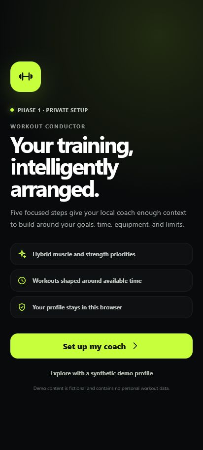
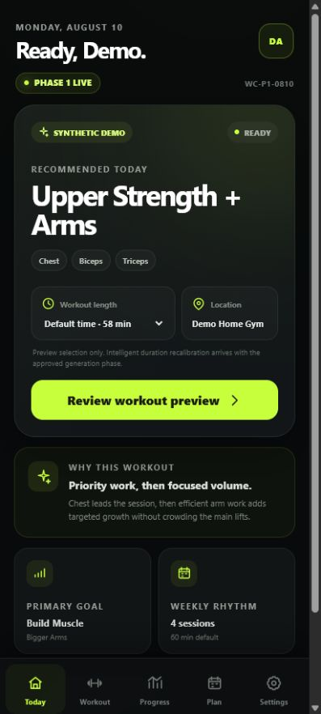
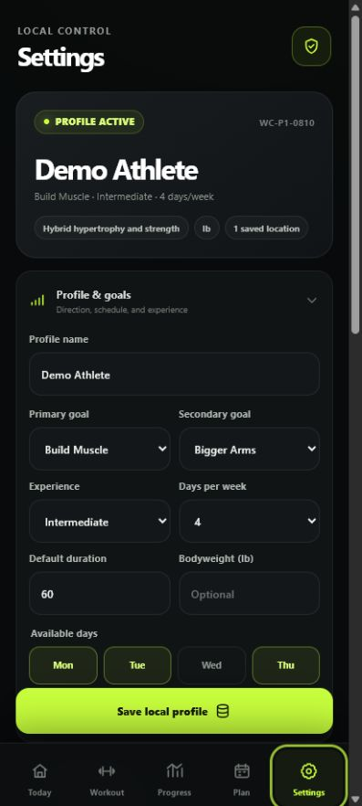

# Workout Conductor — Project Status

| Field                  | Status                                                                                                                                                         |
| ---------------------- | -------------------------------------------------------------------------------------------------------------------------------------------------------------- |
| Repository             | https://github.com/Bill6006/Workout-Conductor-Rebuild                                                                                                          |
| Permanent live app     | https://bill6006.github.io/Workout-Conductor-Rebuild/                                                                                                          |
| Current phase          | Phase 1 — Product Foundation and Onboarding                                                                                                                    |
| Current branch         | `main`                                                                                                                                                         |
| Latest completed phase | Phase 1 — YELLOW pending user Android review                                                                                                                   |
| Work in progress       | Stopped at the Phase 1 review gate                                                                                                                             |
| Latest commit          | [Current `main` commit](https://github.com/Bill6006/Workout-Conductor-Rebuild/commits/main/)                                                                   |
| Latest deployment      | [GitHub Pages workflow](https://github.com/Bill6006/Workout-Conductor-Rebuild/actions/workflows/deploy-pages.yml) — successful                                 |
| Tests                  | 7 unit/storage + 2 Android browser tests passed; lint, formatting, and production build passed                                                                 |
| Known limitations      | Today workout is synthetic; catalog reconciliation, generation, active logging, and full backup migrations remain gated                                        |
| Mobile screenshots     | [Onboarding](screenshots/phase-1/onboarding-412x915.png), [Today](screenshots/phase-1/today-412x915.png), [Settings](screenshots/phase-1/settings-412x915.png) |
| Next concrete action   | Wait for `GREEN - NEXT PHASE`, `YELLOW - FIX: <issue>`, or `RED - STOP`                                                                                        |
| Last updated           | 2026-08-10 13:19 EDT                                                                                                                                           |

## Phase 1 acceptance

- [x] Focused step-by-step onboarding with profile, goals, schedule, places, preferences, and limitations
- [x] Editable athlete profile and app settings
- [x] Multiple saved location and equipment profiles
- [x] Validated `localStorage` settings and durable IndexedDB records
- [x] IndexedDB writes verified by immediate validated read-back
- [x] Schema-versioned export/import foundation with validated imports
- [x] Today dashboard with safe, clearly labeled synthetic workout preview
- [x] One workout-length selector with 15 / 30 / 45 / Default options
- [x] Android-sized browser flows and screenshots complete
- [x] Phase marked YELLOW for user review

## Mobile screenshot

## Data-safety status

The repository contains application code, blank defaults, and synthetic presentation copy only. It contains no workout history, personal notes, backups, contact information, or other private user data.
