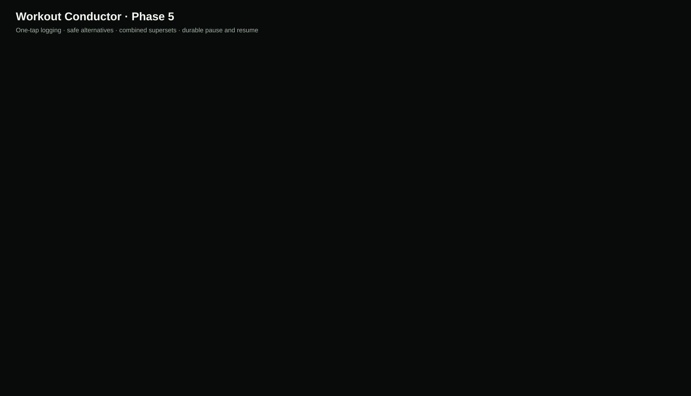

# Workout Conductor — Project Status

| Field                  | Status                                                                                                                                                                                                                                                                                                                                                                                                                                                          |
| ---------------------- | --------------------------------------------------------------------------------------------------------------------------------------------------------------------------------------------------------------------------------------------------------------------------------------------------------------------------------------------------------------------------------------------------------------------------------------------------------------- |
| Repository             | https://github.com/Bill6006/Workout-Conductor-Rebuild                                                                                                                                                                                                                                                                                                                                                                                                           |
| Permanent live app     | https://bill6006.github.io/Workout-Conductor-Rebuild/                                                                                                                                                                                                                                                                                                                                                                                                           |
| Current phase          | Phase 5 — Active Workout, Logging, and Superset Experience                                                                                                                                                                                                                                                                                                                                                                                                      |
| Current branch         | `main`                                                                                                                                                                                                                                                                                                                                                                                                                                                          |
| Latest completed phase | Phase 4 — approved GREEN by user                                                                                                                                                                                                                                                                                                                                                                                                                                |
| Work in progress       | Phase 5 complete and YELLOW pending Android review                                                                                                                                                                                                                                                                                                                                                                                                              |
| Latest commit          | [Current `main` commit](https://github.com/Bill6006/Workout-Conductor-Rebuild/commits/main/)                                                                                                                                                                                                                                                                                                                                                                    |
| Latest deployment      | [GitHub Pages workflow](https://github.com/Bill6006/Workout-Conductor-Rebuild/actions/workflows/deploy-pages.yml)                                                                                                                                                                                                                                                                                                                                               |
| Tests                  | 91 unit/integration + 6 Android browser tests passed; lint, privacy, formatting, build, PWA, persistence, responsive, timer, superset, and visual checks passed                                                                                                                                                                                                                                                                                                 |
| Known limitations      | Adaptive coaching/session feedback remain gated to Phase 6; history/PR analytics and Session Summary to Phase 7; final production media coverage and custom-media backup/restore to Phase 8                                                                                                                                                                                                                                                                     |
| Phase 5 screenshots    | [Combined](docs/screenshots/phase-5/combined-preview.svg), [Active](docs/screenshots/phase-5/active-workout-412x915.png), [360 px Logger](docs/screenshots/phase-5/set-logging-360x800.png), [Alternatives](docs/screenshots/phase-5/alternatives-412x915.png), [Superset](docs/screenshots/phase-5/superset-412x915.png), [Pause](docs/screenshots/phase-5/paused-resume-412x915.png), [Desktop](docs/screenshots/phase-5/active-workout-desktop-1280x900.png) |
| Next concrete action   | Wait for `GREEN - NEXT PHASE`, `YELLOW - FIX: <issue>`, or `RED - STOP`                                                                                                                                                                                                                                                                                                                                                                                         |
| Last updated           | 2026-08-10 19:54 EDT                                                                                                                                                                                                                                                                                                                                                                                                                                            |

## Phase 5 acceptance

- [x] Premium active-workout hierarchy with elapsed, remaining, progress, current target, previous performance, and next preview
- [x] Reusable one-handed Set Logger with one-tap prefilled logging and inline correction
- [x] Durable verified session, completed records, cue memory, pause, resume, and reload behavior
- [x] Wall-clock rest target with quick adjustment, skip, next target, silent completion, and supported vibration
- [x] Exercise guides in active and Alternative contexts; one-slot replacement through the central engine
- [x] Combined two-move superset card, one list row, independent move records, round editing, and direct final completion
- [x] Warm-up accounting exclusions, drop-set presentation, per-exercise notes, Plate Math, and custom-content display
- [x] 360 / 375 / 412 / 430 px and 150% zoom behavior tested without horizontal overflow
- [x] Phase marked YELLOW for user review; Phase 6 not started

## Evidence

The design, persistence, and behavior contract is in [docs/active-workout.md](docs/active-workout.md), with full phase evidence in [docs/phase-reports/PHASE_5.md](docs/phase-reports/PHASE_5.md).

## Data-safety status

The repository contains application code, blank defaults, synthetic test fixtures, and synthetic presentation copy only. Real profile, workout records, and cue memory remain browser-local and are not committed.
