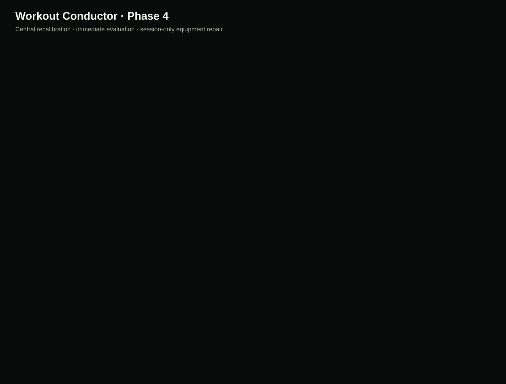

# Workout Conductor — Project Status

| Field                  | Status                                                                                                                                                                                                                                                                                                                                                                                                          |
| ---------------------- | --------------------------------------------------------------------------------------------------------------------------------------------------------------------------------------------------------------------------------------------------------------------------------------------------------------------------------------------------------------------------------------------------------------- |
| Repository             | https://github.com/Bill6006/Workout-Conductor-Rebuild                                                                                                                                                                                                                                                                                                                                                           |
| Permanent live app     | https://bill6006.github.io/Workout-Conductor-Rebuild/                                                                                                                                                                                                                                                                                                                                                           |
| Current phase          | Phase 4 — Central Recalibration Engine                                                                                                                                                                                                                                                                                                                                                                          |
| Current branch         | `main`                                                                                                                                                                                                                                                                                                                                                                                                          |
| Latest completed phase | Phase 4 — YELLOW pending user Android review; Phase 3 approved GREEN                                                                                                                                                                                                                                                                                                                                            |
| Work in progress       | Stopped at the Phase 4 review gate                                                                                                                                                                                                                                                                                                                                                                              |
| Latest commit          | [Current `main` commit](https://github.com/Bill6006/Workout-Conductor-Rebuild/commits/main/)                                                                                                                                                                                                                                                                                                                    |
| Latest deployment      | [GitHub Pages workflow](https://github.com/Bill6006/Workout-Conductor-Rebuild/actions/workflows/deploy-pages.yml)                                                                                                                                                                                                                                                                                               |
| Tests                  | 74 unit/integration + 4 Android browser tests passed; lint, privacy, formatting, build, PWA, responsive, performance, rollback, and visual checks passed                                                                                                                                                                                                                                                        |
| Known limitations      | Active set logging, workout execution controls, timers, resume editing, media, and completed-work editing remain gated to Phase 5                                                                                                                                                                                                                                                                               |
| Phase 4 screenshots    | [Combined](docs/screenshots/phase-4/combined-preview.svg), [Loading](docs/screenshots/phase-4/calibration-loading-412x915.png), [Recalibrated](docs/screenshots/phase-4/recalibration-412x915.png), [Equipment Busy](docs/screenshots/phase-4/equipment-busy-412x915.png), [360 px](docs/screenshots/phase-4/recalibration-360x800.png), [Desktop](docs/screenshots/phase-4/recalibration-desktop-1280x900.png) |
| Next concrete action   | Wait for `GREEN - NEXT PHASE`, `YELLOW - FIX: <issue>`, or `RED - STOP`                                                                                                                                                                                                                                                                                                                                         |
| Last updated           | 2026-08-10 17:18 EDT                                                                                                                                                                                                                                                                                                                                                                                            |

## Phase 4 acceptance

- [x] One centralized, typed, browser-local recalibration engine and trigger registry
- [x] Full, partial, and one-slot local recalibration without scattered decision logic
- [x] Completed sets, completed exercises, logged loads/reps/RIR, PRs, notes, and explicit locks preserved
- [x] Current work locks after its first completed set; pinned and accepted work cannot be silently replaced
- [x] Duration changes subtract elapsed time, protect locked work, and trim future unlocked work only
- [x] Impossible exact-time requests show the closest realistic plan and disclose likely overage
- [x] Location, unavailable equipment, Equipment Busy, skip, replacement, pain/discomfort, recovery/readiness, settings, performance, target-load, resume, and intensity triggers modeled
- [x] Equipment Busy performs one session-only substitution and never mutates the saved location profile
- [x] Immediate blocking overlay, readable evaluation steps, safe cancellation, compact result summary, and changed-row animation
- [x] Immutable pre-change snapshot and atomic rollback on validation or generation failure
- [x] Simple recalibration target under 250 ms and full recalibration target under 700 ms, with no network dependency or artificial multi-second delay
- [x] Supported 360 / 375 / 412 / 430 px widths tested without horizontal overflow
- [x] Phase marked YELLOW for user review

## Evidence

The detailed engine contract and phase evidence are in [docs/recalibration-engine.md](docs/recalibration-engine.md) and [docs/phase-reports/PHASE_4.md](docs/phase-reports/PHASE_4.md).

## Data-safety status

The repository contains application code, blank defaults, synthetic test fixtures, and synthetic presentation copy only. Real profile and workout data remain browser-local and are not committed.
