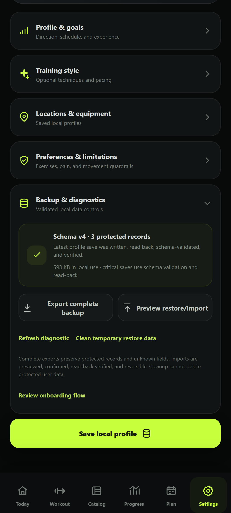

# Workout Conductor — Project Status

| Field                  | Status                                                                                                                                                                                                                                                                                                                |
| ---------------------- | --------------------------------------------------------------------------------------------------------------------------------------------------------------------------------------------------------------------------------------------------------------------------------------------------------------------- |
| Repository             | https://github.com/Bill6006/Workout-Conductor-Rebuild                                                                                                                                                                                                                                                                 |
| Permanent live app     | https://bill6006.github.io/Workout-Conductor-Rebuild/                                                                                                                                                                                                                                                                 |
| Current phase          | Phase 8 — Final Data Safety, PWA, Accessibility, and Cutover                                                                                                                                                                                                                                                          |
| Current branch         | `main`                                                                                                                                                                                                                                                                                                                |
| Latest completed phase | Phase 7 — approved GREEN by user                                                                                                                                                                                                                                                                                      |
| Work in progress       | Phase 8 active-workout navigation enhancement complete and YELLOW pending independent adversarial retest and Android review                                                                                                                                                                                           |
| Build marker           | `WC-P8UX-0814`                                                                                                                                                                                                                                                                                                        |
| Latest commit          | [Current `main` commit](https://github.com/Bill6006/Workout-Conductor-Rebuild/commits/main/)                                                                                                                                                                                                                          |
| Latest deployment      | [GitHub Pages workflow](https://github.com/Bill6006/Workout-Conductor-Rebuild/actions/workflows/deploy-pages.yml)                                                                                                                                                                                                     |
| Tests                  | 146/146 unit and integration tests plus 20/20 Android Chromium scenarios pass; lint, TypeScript, formatting, privacy scan, production build, PWA verification, backup/restore, malformed/tampered rejection, migration, offline reload, keyboard, mobile, landscape, rapid-activation, and reduced-motion checks pass |
| Known limitations      | Independent adversarial retest, hands-on Android install, and final user acceptance remain. Deterministic accessibility acceptance remains in the release suite; the optional third-party axe package is still not installed. No Phase 9 is defined.                                                                  |
| Phase 8 screenshots    | [Today](docs/screenshots/phase-8/final-today-412x915.png), [Data safety](docs/screenshots/phase-8/data-safety-412x915.png), [Production guide](docs/screenshots/phase-8/production-guide-412x915.png), [Desktop data safety](docs/screenshots/phase-8/data-safety-desktop-1265x900.png)                               |
| Next concrete action   | Run an independent adversarial retest against deployed `WC-P8UX-0814`, centered on sticky navigation, durable defer/return, grouped blocks, finish consent, omission accounting, and one-time celebration while preserving every earlier Phase 8 pass.                                                                |
| Last updated           | 2026-08-14 09:20 EDT                                                                                                                                                                                                                                                                                                  |

## Phase 8 acceptance

- [x] Complete exports include every protected store and local setting
- [x] Unknown fields survive exact backup and restore
- [x] Imports have a no-change preview and explicit confirmation
- [x] Restore read-back verification, automatic rollback, and manual rollback
- [x] Legacy v1 migration preserves workout history and newer protected content
- [x] Custom exercise, local media, exercise note, equipment, and Coach target recovery coverage
- [x] Critical saves complete only after schema validation and read-back
- [x] Compact storage diagnostic and temporary-only cleanup
- [x] Explicit PWA update prompt and unfinished-workout deferral
- [x] Install manifest, controlled service worker, and offline reload
- [x] Production-owned offline demonstration coverage for all enabled exercises
- [x] Semantic, keyboard, alternative-text, touch-target, and reduced-motion checks
- [x] Responsive widths plus 150% and 200% mobile zoom without horizontal overflow
- [x] Full automated suite and visually inspected Android-sized release evidence
- [x] All ten first-pass adversarial QA findings resolved with regression coverage
- [x] Four retest findings repaired with unit-safe migration and click-through coverage
- [x] Final independent-retest finding repaired with rendered mixed-unit history-card coverage
- [x] Sticky workout navigator with Current, Queue, Note, Plates, and Skip actions
- [x] Durable prescription-level skip/return across reload, pause/resume, supersets, and circuits
- [x] Explicit missed-exercise finish consent and omission-safe session summaries
- [x] Verified one-time celebration with reduced-motion alternative
- [x] Phase marked YELLOW for independent retest; no Phase 9 started

## Evidence

The complete release record is in [docs/cutover-report.md](docs/cutover-report.md), the latest enhancement is in [docs/phase-reports/PHASE_8_UX_ENHANCEMENT.md](docs/phase-reports/PHASE_8_UX_ENHANCEMENT.md), and exact contracts remain in [docs/data-safety.md](docs/data-safety.md) and [docs/pwa-and-accessibility.md](docs/pwa-and-accessibility.md).

## Data-safety status

The repository contains application code, blank defaults, synthetic test fixtures, and synthetic presentation evidence only. Real profiles, workout records, notes, media, and Coach targets remain browser-local unless the user explicitly exports them.
