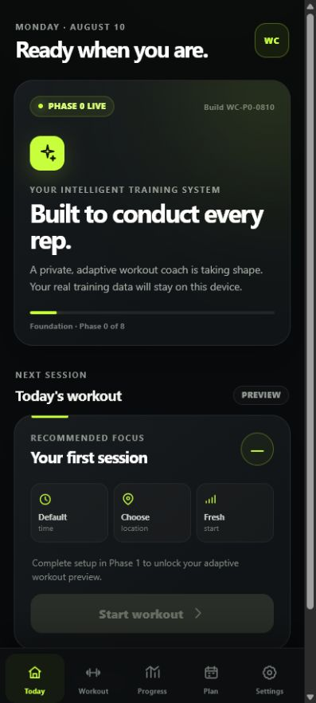

# Workout Conductor — Project Status

| Field                  | Status                                                                                                                         |
| ---------------------- | ------------------------------------------------------------------------------------------------------------------------------ |
| Repository             | https://github.com/Bill6006/Workout-Conductor-Rebuild                                                                          |
| Permanent live app     | https://bill6006.github.io/Workout-Conductor-Rebuild/                                                                          |
| Current phase          | Phase 0 — Repository, Live Pages, and Scaffold                                                                                 |
| Current branch         | `main`                                                                                                                         |
| Latest completed phase | Phase 0 — YELLOW pending user Android review                                                                                   |
| Work in progress       | Stopped at the Phase 0 review gate                                                                                             |
| Latest commit          | [Current `main` commit](https://github.com/Bill6006/Workout-Conductor-Rebuild/commits/main/)                                   |
| Latest deployment      | [GitHub Pages workflow](https://github.com/Bill6006/Workout-Conductor-Rebuild/actions/workflows/deploy-pages.yml) — successful |
| Tests                  | 3 unit + 1 Android browser test passed; lint, formatting, and production build passed                                          |
| Known limitations      | Phase 0 shell only; onboarding, saved profiles, and workouts begin in later approved phases                                    |
| Mobile screenshots     | [Android 412×915](screenshots/phase-0/android-412x915.png)                                                                     |
| Next concrete action   | Wait for `GREEN - NEXT PHASE`, `YELLOW - FIX: <issue>`, or `RED - STOP`                                                        |
| Last updated           | 2026-08-10 12:31 EDT                                                                                                           |

## Phase 0 acceptance

- [x] Separate new public repository created
- [x] Initial scaffold committed and pushed
- [x] CI passing on the final Phase 0 commit
- [x] GitHub Pages live on the permanent URL
- [x] Today / Workout / Progress / Plan / Settings shell implemented
- [x] Current phase and visible build marker implemented
- [x] Android-sized browser test and screenshot complete
- [x] Master issue and milestone created
- [x] Phase marked YELLOW for user review

## Mobile screenshot

## Data-safety status

The repository contains application code, blank defaults, and synthetic presentation copy only. It contains no workout history, personal notes, backups, contact information, or other private user data.
