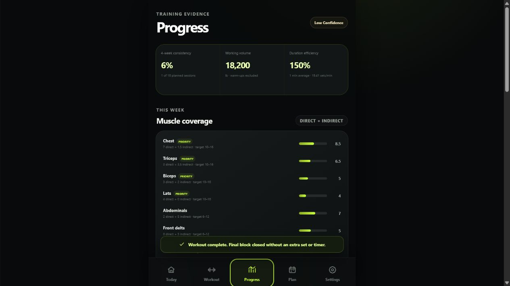

# Workout Conductor — Project Status

| Field                  | Status                                                                                                                                                                                                                            |
| ---------------------- | --------------------------------------------------------------------------------------------------------------------------------------------------------------------------------------------------------------------------------- |
| Repository             | https://github.com/Bill6006/Workout-Conductor-Rebuild                                                                                                                                                                             |
| Permanent live app     | https://bill6006.github.io/Workout-Conductor-Rebuild/                                                                                                                                                                             |
| Current phase          | Phase 7 — Progress, Plan, Coverage, PRs, and Session Summary                                                                                                                                                                      |
| Current branch         | `main`                                                                                                                                                                                                                            |
| Latest completed phase | Phase 6 — approved GREEN by user                                                                                                                                                                                                  |
| Work in progress       | Phase 7 complete and YELLOW pending Android review                                                                                                                                                                                |
| Build marker           | `WC-P7-0811`                                                                                                                                                                                                                      |
| Latest commit          | [Current `main` commit](https://github.com/Bill6006/Workout-Conductor-Rebuild/commits/main/)                                                                                                                                      |
| Latest deployment      | [GitHub Pages workflow](https://github.com/Bill6006/Workout-Conductor-Rebuild/actions/workflows/deploy-pages.yml)                                                                                                                 |
| Tests                  | 102 unit/integration + 6 Android browser tests passed; lint, privacy, formatting, production build, PWA, persistence, analytics, PR, saved-workout, responsive, and visual checks passed                                          |
| Known limitations      | Complete backup/restore, optional legacy migration, service-worker update safety, accessibility acceptance, final production demonstration coverage, and final polish remain gated to Phase 8                                     |
| Phase 7 screenshots    | [Progress](docs/screenshots/phase-7/progress-analytics-desktop-1265x900.png), [Session Summary](docs/screenshots/phase-7/session-summary-desktop-1265x900.png), [Plan](docs/screenshots/phase-7/weekly-plan-desktop-1265x900.png) |
| Next concrete action   | Wait for `GREEN - NEXT PHASE`, `YELLOW - FIX: <issue>`, or `RED - STOP`                                                                                                                                                           |
| Last updated           | 2026-08-11 02:15 EDT                                                                                                                                                                                                              |

## Phase 7 acceptance

- [x] Completed-workout history, clean empty state, and four-week consistency
- [x] Working volume, active duration efficiency, and working-set density
- [x] Direct/indirect weekly muscle coverage and priority target bands
- [x] Estimated strength trends with a two-session minimum
- [x] Exercise progress, evidence ranking, and useful exercise notes
- [x] Warm-up/drop-set-safe load, rep, volume, and top-of-range PR detection
- [x] Compact active/completion PR badges
- [x] Weekly planning and verified reusable saved workouts
- [x] Evidence formulas, sample count, and confidence
- [x] Full Session Summary with recovery, substitutions, next targets, and next focus
- [x] Manual synthetic browser path and automated release suite pass
- [x] Phase marked YELLOW for user review; Phase 8 not started

## Evidence

The analytics contract is in [docs/analytics.md](docs/analytics.md), with full phase evidence in [docs/phase-reports/PHASE_7.md](docs/phase-reports/PHASE_7.md).

## Data-safety status

The repository contains application code, blank defaults, synthetic test fixtures, and synthetic presentation evidence only. Real profile, workout records, and cue memory remain browser-local and are not committed.
